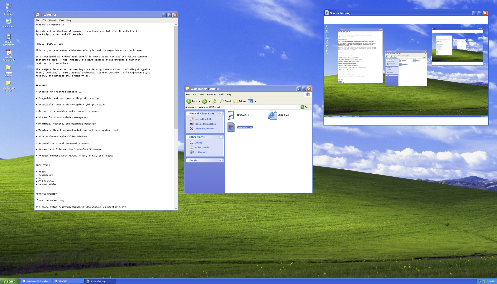

# Windows XP Portfolio

An interactive Windows XP-inspired developer portfolio built with React, TypeScript, Vite, and CSS Modules.



## Project Description

This project recreates a Windows XP-style desktop experience in the browser. It is designed as a developer portfolio where users can explore resume content, project folders, links, images, and downloadable files through a familiar desktop-style interface.

The project focuses on recreating core desktop interactions, including draggable icons, selectable items, openable windows, taskbar behavior, File Explorer-style folders, and Notepad-style text files.

## Features

- Windows XP-inspired desktop UI
- Draggable desktop icons with grid snapping
- Selectable icons with XP-style highlight states
- Openable, draggable, resizable windows
- Window focus and z-index management
- Minimize, restore, and maximize behavior
- Taskbar with active window buttons and live system clock
- File Explorer-style folder windows
- Notepad-style text document windows
- Resume text file and downloadable PDF resume
- Project folders with README files, links, and images

## Tech Stack

- React
- TypeScript
- Vite
- CSS Modules
- re-resizable for window resizing behavior

## Current Project Folders

- Roamio
- Windows XP Portfolio

## Getting Started

Clone the repository:

```bash
git clone https://github.com/davidiuku/windows-xp-portfolio.git
cd windows-xp-portfolio
```

Install dependencies:

```bash
npm install
```

Start the development server:

```bash
npm run dev
```

Build the project:

```bash
npm run build
```

## Future Improvements

- Image viewer polish to match authentic Windows Picture and Fax Viewer
- More complete File Explorer navigation
- Start menu functionality
- Additional project folders
- Improved responsive behavior for smaller screens
- Playable Minesweeper game
